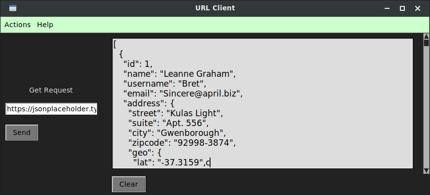

# Tkinter Url Client.

__This is a small url client maked with python and tkinter.__
__You can make request get, post, put and delete set the url and sending the request.__


## Dependencies.
__This project depend of tkinter and requests module, you can install the request from requirements file executing:__

```bash
$ pip3 install -r requirements.txt
```

__And tkinter with:__

#### Debian or Ubuntu GNU/Linux
```bash
$ sudo apt-get install python3-tk
```

#### Windows
```bash
$ pip install python3-tk
```

__Some references for install tkinter in windows.__
* [https://www.it-swarm-es.com/es/python/como-pip-o-easy-install-tkinter-en-windows/1043173151/](https://www.it-swarm-es.com/es/python/como-pip-o-easy-install-tkinter-en-windows/1043173151/)


## Run.

```bash
git clone https://github.com/EduardYan/Tkinter-url-client.git
cd Tkinter-url-client

```

__For run execute:__

```bash
$ python3 app.py
```

## Use.

__Your can set the url and send. In case of post and put delete, your must set the data for send. The syntax is:__

```txt
name=Test&price=23
```

## Screenshot.



## Notes.
__The program is not able to send json, only for url__
